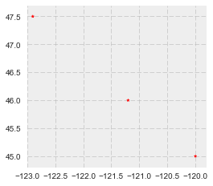
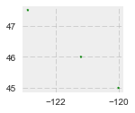

```python
# I will be using these packages over the course of the week
%matplotlib inline 
import os
import matplotlib.pyplot as plt
import seaborn as sns
plt.style.use('bmh')
from shapely.geometry import Point
import pandas as pd
import geopandas as gpd
from geopandas import GeoSeries, GeoDataFrame; data_pth = "../data"
from shapely.wkt import loads
data_pth = "../data"


```

Encodings, formats and libraries
Standard encodings and libraries for projections, codes = GeoPandas.to_srs
GeoPandas solves problemns by enabling operations on feature collecions in one step, and bundling multiple tools via an interface that builds on Pandas.


Vectors in Geospatial Data refer to discrete geometric entities also called objects features or shapes that represent distinct "things" on the land surface or underwater. These entities or object types typically are not used to represent continuously varying fields, rasters or tessellations.
Examples of vectors include points and polygons.
Simple features (SF) represent two-dimensional planar geometric objects.
Single entity: point, line (LineString), Polygon
Homogeneous entity collections: multi-Point, multi-Line (MultiLineString), Multi-Polygon.
SF lingo states that a feature refers to a spatial entity (any of the above) and encompasses both its geometry and its associated attributes (e.g. name, categories, value of some property like population density). A feature collection is then a list or collection of features. Most GIS vector data sets are feature collections.
Geospatial operations: relationships and operations include: buffer, convex hull, touch, intersection, union etc.
While latitude and longitude can accurately represent a location on the Earth's surface, performing area and distance calculations on an ellipsoid (or spheroid) can be pretty challenging. Instead of working on this unprojected or geodectic coordinate reference system (CRS), one transforms spatial objects and coordinates into a projected CRS (projecting the curved surface into a cartesian plane), particularly when working at scales that are not global ( such as continental, regional or highly local).
GeoPandas adds spatial geometry datatypes to Pandas and enables spatial operations on these types, using Shapely.


GeoSeries: The geometry building block:
Like a Pandas Series, a GeoSeries is the building block for the more broadly useful and powerful GeoDataFrame. A GeoSeries is made up of an index and a GeoPandas geometry datatype. This datatype is a shapely.geometry object, and  therefore inherits their attributes and methods such as area, bounds, distance, etc.
GeoPandas has six classes of geometric objects, corresponding to the three basic single entity types and their associated homogeneous collections of multiple entities. Single Entity (core and basic type)
Point 
Line (formally known as a LineString)
Polygon

Homogeneous entity collections:
Multi-Point
Multi-Line
Multi-Polygon

A GeoSeries is then a list of geometric objects and their associated index values. GeoPandas does not constrain the geometry column to be of the same geometry type. This leads to problems if I am using shape files, files that store a single geometry type. 
Here I will practice some basics with GeoSpatial data.


Create a GeoSeries from a list of shapely point objects contructed directly from WKT text (rare situation)


```python
from shapely.wkt import loads
GeoSeries([loads('POINT(1 2)'), loads('POINT(1.5 2.5)'), loads('POINT(2 3)')])

```


    0        POINT (1 2)
    1    POINT (1.5 2.5)
    2        POINT (2 3)
    dtype: object


Now, I will create a GeoSeries from a list of shapely Point objects, then enhance it with CRS and plot it.


```python
gs = GeoSeries([Point(-120, 45), Point(-121.2,46), Point(-122.9, 47.5)])
gs
```


    0        POINT (-120 45)
    1      POINT (-121.2 46)
    2    POINT (-122.9 47.5)
    dtype: object


```python
type(gs), len(gs)
```


    (geopandas.geoseries.GeoSeries, 3)


A GeoSeries( and a GeoDataFrame) can store a CRS implicitly associated wit the geometry column. This is useful as essential spatial metadata and for transformation (reprojection) to another CRS.


```python
gs.crs = {'init': 'epsg:4326'}

```

The plot method accepts standard matplotlib.pyplot style options, and can be tweaked like any other matplotlib figure. 


```python
gs.plot(marker = '*', color = 'red', markersize = 12, figsize=(4,4))
plt.xlim([-123,-119.8])
plt.ylim([44.8,47.7])
```


    (44.8, 47.7)





Before GeoDataFrames lets define a simple dictionary of lists.


```python
data = {'name':['a','b','c'], 'lat':[45,46,47.5],'lon':[-120,-121.2,-122.9]}

```

Noting this convenient compact approach to creat a list of point shapely objects out of X & Y coordinate lists:


```python
geometry = [Point(xy) for xy in zip(data['lon'],data['lat'])]
geometry
```


    [<shapely.geometry.point.Point at 0x11af98588>,
     <shapely.geometry.point.Point at 0x11afe2eb8>,
     <shapely.geometry.point.Point at 0x11afe2c50>]


Now we'll explicitly define the index values: 


```python
gs = GeoSeries(geometry, index = data['name'])
gs
```


    a        POINT (-120 45)
    b      POINT (-121.2 46)
    c    POINT (-122.9 47.5)
    dtype: object


A GeoDataFrame is a Feature Collection, where each row is a Feature, a geometry column is defined (name doesnt need to be geometry) and the attribute properties are simply the other columns (the Pandas DataFrame part).
We'll build on the GeoSeries example, reusing the data dictionary to create a DataFrame. 
        
        
        


```python
df = pd.DataFrame(data)
df
```


<div>
<table border="1" class="dataframe">
  <thead>
    <tr style="text-align: right;">
      <th></th>
      <th>lat</th>
      <th>lon</th>
      <th>name</th>
    </tr>
  </thead>
  <tbody>
    <tr>
      <th>0</th>
      <td>45.0</td>
      <td>-120.0</td>
      <td>a</td>
    </tr>
    <tr>
      <th>1</th>
      <td>46.0</td>
      <td>-121.2</td>
      <td>b</td>
    </tr>
    <tr>
      <th>2</th>
      <td>47.5</td>
      <td>-122.9</td>
      <td>c</td>
    </tr>
  </tbody>
</table>
</div>


Now we use the DataFrame and the "list-of-all-shapely-Point-objects" approach to create a GeoDataFrame. Noting the use of two GeoDataFrame attribute columns, which are two Pandas Series. 


```python
geometry = [Point(xy) for xy in zip(df['lon'],df['lat'])]
gdf = GeoDataFrame(df, geometry = geometry)
```

Here I am using the plot method from GeoDataFrame.


```python
gdf.plot(marker='*', color='green', markersize=6, figsize=(2, 2));
```





Real data now! gpd.read_file is the workhorse for reading GIS files.


```python
cwd = os.getcwd()
#oceans = gpd.read_file(os.path.join(cwd, "oceans.shp"))

#oceans.head()
```


```python
cwd = os.getcwd()
cwd
```


    '/Users/markconrad/Documents/GeoHack Week'


```python

```


```python

```


```python

```


```python

```


```python

```


```python

```


```python

```


```python

```


```python

```


```python

```


```python

```


```python

```


```python

```


```python

```


```python

```


```python

```


```python

```


```python

```


```python

```


```python

```


```python

```


```python

```


```python

```


```python

```
